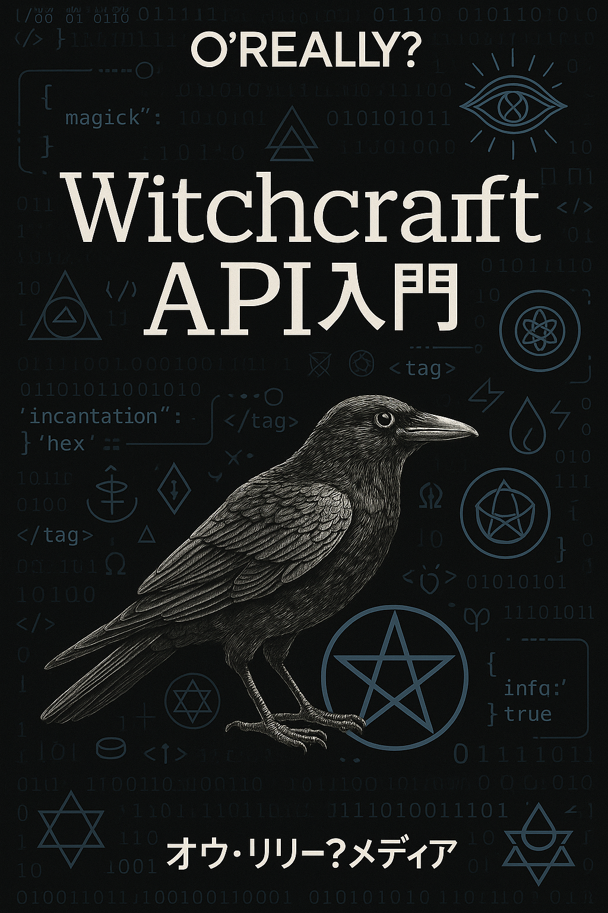
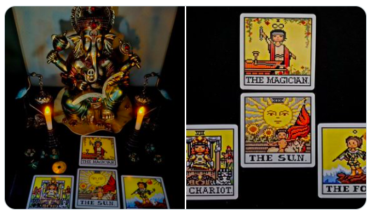
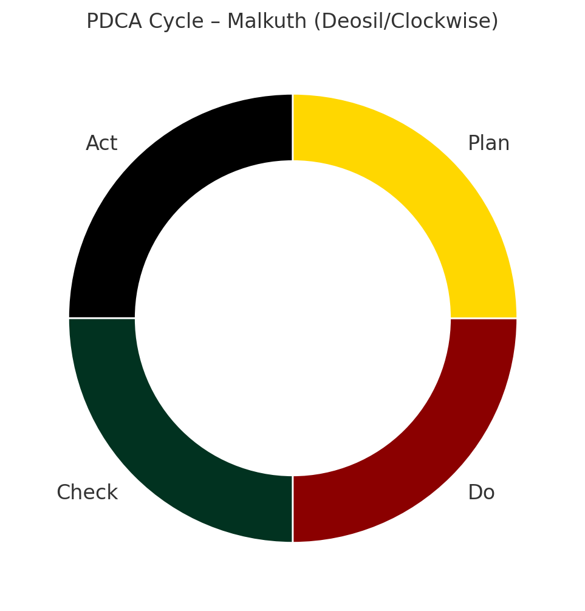

# 🧠 Witchcraft API v0.1

 

  

Open Source Witchcraftの構造的バックボーンとして本ドキュメントでは「Witchcraft API」と呼ばれる7階層モデルを提示する。
このモデルは、現代魔術の実践を柔軟かつ反復可能なシステムとして捉えるためのものである。

---

# 🔧 7階層構造の概要

| レイヤー | 名称 | 概要 | 実装例・リンク |
|---------|------|------|-----------------|
| 7 | Application | 個別儀式・願望（例：金運儀式、転職など） | ー |
| 6 | Ritual Protocol | 儀式の構造と順序 | [POP MAGIC](https://github.com/ravensgate-tux/pop_magic_annotation)（Grant Morrisonによる儀式的実践） |
| 5 | Symbolic Framework | 象徴の選定・意味付け | ー |
| 4 | Interface Objects | 道具やカード、ワンドなど | ー |
| 3 | Transmission Layer | 言葉、夢、バイブレーションなど | [シャーマニズム技法（Phil Hine）](https://github.com/ravensgate-tux/hine_modern_shamanism/blob/main/README.md)（Phil Hineによる現代シャーマニズムの技法） |
| 2 | Environment Setup | 結界、方位、配置、空間の設計 | ー |
| 1 | Physical Layer | キャンドル、紙、タロットカードなどの物理要素 |  |

💡補足：ここで示した「Witchcraft API」の7レイヤー構造は、IT分野におけるOSI参照モデル（Open Systems Interconnection model）の階層構造を参考に再構成されたものです。

---

# 🔁 アナロジー：ITと魔術の対応表（一部）

## 🔄 アナロジー：ITと魔術の対応表（一部）

| IT用語                 | 魔術的な対応概念                                                  |
|------------------------|-------------------------------------------------------------------|
| Firewall               | 魔法円や五芒星                                                     |
| DMZ                    | 儀式空間、神聖なゾーン、T.A.Z.（一時的自立ゾーン）               |
| VPN / トンネル         | 夢、アストラル体験、瞑想経路                                     |
| Encryption / Decryption| シジルの作成と解読、神殿の象徴構造                               |
| On-Premises / Cloud    | 物理神殿／アストラル神殿                                          |
| Log / Monitoring       | 影の書（book of shadows）、儀式記録、夢日記、ワークブック         |
| Password               | 神殿に設定するパスワード（これが一致しないと使えない）           |

## 🗝️ 神殿の公開とパスワード

このプロジェクトでは、「神殿の構造や儀式を公開する」という行為に対して  
現代ITにおける**公開鍵暗号**の仕組みからインスピレーションを得ています。

> 公開鍵（儀式文・象徴・道具）は誰でも見られるが、  
> 秘密鍵（意図・共鳴・パスワード）がなければ効果は起動しない。

---

## 🔁 実践とPDCAサイクル

Witchcraft APIの重要な柱の一つは、PDCA（Plan-Do-Check-Act）による反復実践である。多くの実践者が儀式を行うこと自体に満足してしまいがちだが、**魔術は意図を送り出し、それがどのように現実に作用するかを観察・検証し、改善することで洗練される**。

👀この視点は、テイラー・エルウッド（Taylor Ellwood）の『Magical Experiments: Practical Magic for Consistent Results』や、
ジェイソン・ミラーの「The Strategic Sorcery」コースから多くを学び、実践を通じて形成されたものです。
特に、魔術の実験結果を記録・共有するという取り組みに参加した経験は、
「魔術を再現可能な設計として扱う」ための視点を育ててくれました。
こうした記録と検証、戦略的な儀式設計の考え方は、
日本における魔術実践においても強く共有されるべき基盤であると考えています。

📙魔法に対するPDCAサイクルの重要性は、現代魔術の実践家ジェイソン・ミラー（Jason Miller）の『Strategic Sorcery』でも強調されています。

---

### 📘 事例：キャンプ地での安全祈願の儀式（PDCA適用例）

**目的：** キャンプ中の安全と快適な滞在を願う儀式を行う。
- 📜 *儀式：[🔗 prayer_to_campground.md](https://github.com/ravensgate-tux/prayer_to_campground/blob/main/README.md)
  
#### 🧪 初回の試行（実行→評価）

| レイヤー | 評価内容                                                                 |
|--------|--------------------------------------------------------------------|
| 1（物理）       | キャンドルやカードを持参したが、祭壇が不安定だった。                                      |
| 2（環境）       | 方角を誤って配置。西（水の方向）を背にしていた。                                       |
| 3（伝達）       | 祈りの言葉に集中できず、バイブレーションが弱かった。                                     |
| 4（象徴装置）    | 選んだカードに明確な意図を込められなかった。                                            |
| 5（象徴枠組）    | 水と西方の神性への敬意が抜けていた。                                                  |
| 6（プロトコル）  | 儀式の順序が曖昧になり、即興になっていた。                                              |
| 7（願望・実行） | 「安全な滞在を祈る」という目的が曖昧だった。                                           |

👉 **結果**：その夜に豪雨が降り、テント内が浸水。クラクションや周囲の騒音にも集中できず、心が乱れた。

#### 🔸 次回への改善（計画→再実行）

- 方角と天候の確認を事前に行い、西に水に関する象徴を配置。  
- 儀式の構文と祈り文を準備し、バイブレーションの練習を行う。  
- 持参するカードやタリスマンを再選定し、象徴に明確な意味を持たせた。  
- 儀式手順を紙に書いて確認、順序と目的を明確化。  

→ 結果：次回のキャンプでは儀式が整い、静かな集中の中で行えた。滞在も快適で、安全に終えることができた。

---

#### 🧙‍♀️魔法・呪術の位置づけ

Ravensgateでは魔法を**現実をより良くするための確率的な影響技術**として扱っています。  
この考え方は、現代の実践魔術師ジェイソン・ミラー（Jason Miller）の以下の定義に強く共鳴しています：

> **"Make a plan that could work without magick, then use magick to make that plan work better."**  
> （魔術がなくても成立する計画を立て、それをより良く機能させるために魔術を使え）
>
> **"Magick is an influence on probability and minds."**  
> （魔術とは、確率と人の心に影響を与えるものである）
>
>つまり「バッドラックをグッドラックにする技術」とも言える

---

#### 🧨 Detonosis（デトノーシス）

**Detonosis とは、意図が選択へと進化し、全身全霊でその現実を「選びきる」瞬間に生じる、不可逆の魔術的意識状態を指します。**
これは覚悟であり、完全なるアファメーションであり、💣に火を入れる導火線の点火🔥でもあります。
一度この領域に達した願いは、もはや「願い」ではなく、「選ばれた現実」となる。

※ Detonosis は「gnosis（グノーシス）」をベースにした造語であり、「戻れない選択」の瞬間を指すRavensgate独自の用語です。
「Let it burn. 💣🔥Detonosis.」

📌 **補足：スペアやハインの「忘れろ」という教義は、この「導火線に火をつけたらもう手を出すな」という意味で解釈できます。**
つまり「忘却」とは記憶を抑圧するのではなく、魔術的プロセスに手を加えないという作動後のロック状態（Lock After Ignition）を意味します。
Ravensgateではこの考えを「Forget as Lock（忘却＝作動中フラグ）」として採用しています。

---
## 🐌 TUXとは？

このプロジェクトにおける **TUX** は、  
**Theurgic User eXperience（神性との接触としてのユーザー体験）** を意味する、Open Source Witchcraft のマスコットです。

TUXはカタツムリをモチーフにしています。  
殻を背負い、ゆっくりと、しかし確実に進みながら、  
その触角で世界の魔術的な兆候を感じ取り、神性との接続を導きます。

TUXは私たちにこう語りかけます：

> 「魔術は急いで動くことではなく、  
>  静けさと感性、そして選びきる意志から始まる。」

🐚 GitHubのアカウント名 `ravensgate-tux` は、このちいさな魔術的旅人へのオマージュです。

---

© 2025 知られざる呪術師（Le Sorcier Inconnu）  
本ドキュメントは [Creative Commons BY-SA 4.0](https://creativecommons.org/licenses/by-sa/4.0/deed.ja) に基づき公開されています。
