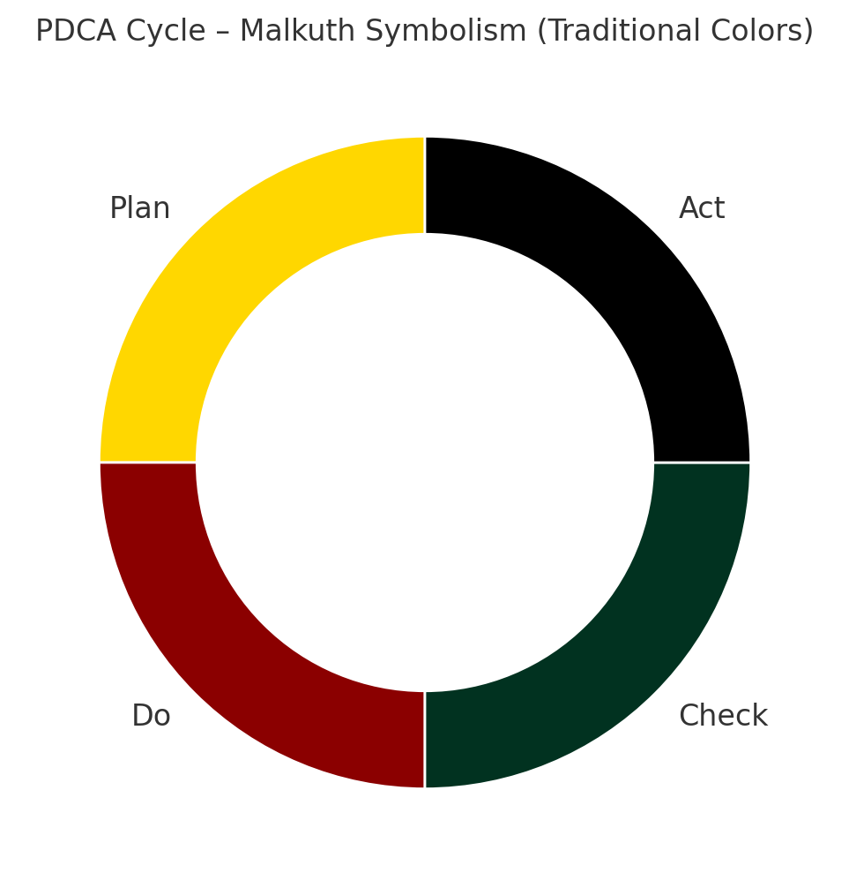

# 🧠 Witchcraft API v0.1（暫定版）

Open Source Witchcraftの構造的バックボーンとして、本ドキュメントでは「Witchcraft API」と呼ばれる7階層モデルを提示する。このモデルは、現代魔術の実践を柔軟かつ反復可能なシステムとして捉えるためのものである。

---

## 🔧 7階層構造の概要

- **Layer 7: Application** – 個別儀式・願望（例：金運儀式、転職など）
- **Layer 6: Ritual Protocol** – 儀式の構造と順序
- **Layer 5: Symbolic Framework** – 象徴の選定・意味付け
- **Layer 4: Interface Objects** – 道具やカード、ワンドなど
- **Layer 3: Transmission Layer** – 言葉、夢、バイブレーション
- **Layer 2: Environment Setup** – 結界、方位、配置など
- **Layer 1: Physical Layer** – キャンドル、紙、タロットなどの物理要素

---

## 🔄 アナロジー：ITと魔術の対応表（一部）

- **Firewall** → 魔法円や五芒星
- **DMZ** → 儀式空間、神聖なゾーン
- **Converter** → 象徴体系間の翻訳（例：RWS⇔Thoth）
- **VPN / トンネル** → 夢、アストラル神殿、瞑想経路
- **Encryption / Decryption** → シジルの作成と解読
- **On-Prem / Cloud** → 物理神殿／アストラル神殿
- **Log / Monitoring** → 儀式記録、夢日記、ワークブック

---

## 🔁 実践とPDCAサイクル

Witchcraft APIの重要な柱の一つは、PDCA（Plan-Do-Check-Act）による反復実践である。多くの実践者が儀式を行うことに満足してしまいがちだが、**魔術は意図を送り出し、それがどのように現実に作用するかを観察・検証し、改善することで洗練される**。

この視点は、テイラー・エルウッド（Taylor Ellwood）の『Magical Experiments: Practical Magic for Consistent Results』から多くを学んでいる。再現可能な魔術、記録と検証、戦略的な設計という考え方は、日本における魔術実践にも強く共有されるべき基盤である。

---

📝 本ドキュメントおよび構成図はCreative Commons Attribution 4.0 International（CC BY 4.0）ライセンスのもとで公開される予定です。
